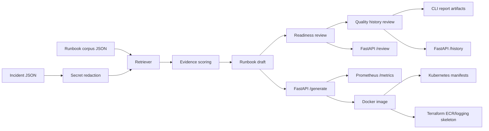

# ai-incident-runbook-generator

Production-shaped AI platform project for turning incident signals into a safe,
evidence-backed runbook draft.

The project uses deterministic retrieval and ranking instead of a hosted LLM so it can
run locally without secrets. It still mirrors a production LLM runbook workflow: sanitize
incoming evidence, retrieve the most relevant runbook sections, score confidence, return
actions and escalation guidance, expose metrics, and package the service for deployment.

## Business Problem

During incidents, platform teams need a fast starting point that is grounded in known
procedures and does not leak tokens, credentials, or customer data into prompts or logs.
This service creates a concise first-draft runbook from alerts, logs, service names, and
existing runbook snippets so engineers can move faster without inventing actions under
pressure.

This upgrade also adds a runbook readiness review gate. The gate checks whether a
generated draft has enough confidence, evidence, checks, actions, escalation guidance, and
human approval coverage before it is handed to an on-call engineer.

The latest upgrade adds a runbook quality history review. It replays dated incident
windows through the same generator, summarizes pass/review/block decisions, counts
redactions, and produces a Markdown artifact that shows whether generated runbooks are
getting safer or drifting toward manual escalation.

## Architecture



## What It Demonstrates

- AI platform support workflow without hardcoded secrets or external model calls
- Retrieval-style ranking, evidence scoring, redaction, and deterministic output
- Shared business logic across CLI and FastAPI
- Runbook readiness review with approve, review, and block decisions
- Multi-window runbook quality history with redaction and readiness trend evidence
- Prometheus metrics for generated drafts, review decisions, confidence, readiness, and latency
- Tests, linting, Docker, Kubernetes, Terraform skeleton, and CI-ready automation

## Repository Layout

```text
.
├── docs                  # Case study and CI workflow template
├── infra                 # Docker, Kubernetes, and Terraform assets
├── samples               # Incident and runbook corpus fixtures
├── src/app               # FastAPI service and Prometheus metrics
├── src/runbook_generator # Redaction, retrieval, generation, CLI
└── tests                 # Engine, CLI, and API tests
```

## Local Setup

```bash
make setup
```

## Run Tests

```bash
make test
make lint
```

## Generate a Runbook Draft

```bash
make sample
make sample-markdown
make sample-review
make history-report
```

Output is written to `reports/payment_latency_runbook.json`.
The Markdown version is written to `reports/payment_latency_runbook.md`.
The readiness review is written to `reports/payment_latency_readiness_review.md`.
The history review is written to `reports/runbook_quality_history.md`.

Direct CLI:

```bash
PYTHONPATH=src:. .venv/bin/python -m runbook_generator.cli generate \
  --incident samples/payment_latency_incident.json \
  --runbooks samples/runbook_corpus.json \
  --output reports/payment_latency_runbook.json \
  --min-confidence 0.25
```

Markdown output for an incident ticket:

```bash
PYTHONPATH=src:. .venv/bin/python -m runbook_generator.cli generate \
  --incident samples/payment_latency_incident.json \
  --runbooks samples/runbook_corpus.json \
  --format markdown \
  --output reports/payment_latency_runbook.md
```

Review an existing generated runbook before handoff:

```bash
PYTHONPATH=src:. .venv/bin/python -m runbook_generator.cli review \
  --runbook reports/payment_latency_runbook.json \
  --format markdown \
  --output reports/payment_latency_readiness_review.md
```

Use `--fail-on-review` when this command should fail the pipeline for drafts that need
manual review, not only drafts that are fully blocked.

Review a dated set of generated runbooks:

```bash
PYTHONPATH=src:. .venv/bin/python -m runbook_generator.cli history \
  --manifest samples/history_manifest.json \
  --format markdown \
  --output reports/runbook_quality_history.md
```

The sample history intentionally returns `block` because one unknown billing incident lacks
enough approved runbook confidence for an on-call handoff.

## Run the API

```bash
make run
```

Health:

```bash
curl http://localhost:8080/health
```

Generate:

```bash
curl -X POST http://localhost:8080/generate \
  -H "Content-Type: application/json" \
  --data-binary @samples/api_request.json
```

Review:

```bash
RUNBOOK_JSON="$(curl -s -X POST http://localhost:8080/generate \
  -H "Content-Type: application/json" \
  --data-binary @samples/api_request.json)"
curl -X POST http://localhost:8080/review \
  -H "Content-Type: application/json" \
  -d "{\"runbook\":$RUNBOOK_JSON}"
```

History review:

```bash
curl -X POST http://localhost:8080/history \
  -H "Content-Type: application/json" \
  -d '{"windows":[{"run_id":"example","generated_at":"2026-07-03T18:45:00Z","runbook":'"$RUNBOOK_JSON"'}]}'
```

Metrics:

```bash
curl http://localhost:8080/metrics
```

## Docker

```bash
make docker-build
make docker-run
```

Docker Compose:

```bash
docker compose up --build
```

## Kubernetes

Build and push an image, update `infra/k8s/deployment.yaml`, then apply:

```bash
kubectl apply -k infra/k8s
kubectl rollout status deployment/ai-incident-runbook-generator
kubectl port-forward service/ai-incident-runbook-generator 8080:80
```

The manifests include probes, resource requests and limits, Prometheus scrape annotations,
and a restricted container security context.

## Terraform

`infra/terraform` contains a small AWS skeleton for ECR and CloudWatch Logs:

```bash
cd infra/terraform
cp terraform.tfvars.example terraform.tfvars
terraform init
terraform plan
```

It avoids runtime compute so reviewers can inspect infrastructure intent without cloud spend.

## Observability

Prometheus-compatible metrics exposed at `/metrics`:

- `runbook_generations_total{status=...}`
- `runbook_generation_confidence`
- `runbook_generation_seconds`
- `runbook_reviews_total{decision=...}`
- `runbook_readiness_score`
- `runbook_history_reviews_total{status=...}`

The generated draft also includes `redaction_count`, `matched_sections`, and `risk_flags`.
The readiness review includes `decision`, `readiness_score`, `required_human_approval`, and
finding-level recommendations.
The history review includes `status`, per-window readiness decisions, redaction totals, and
recommendations for blocked or approval-required drafts.

## CI/CD Note

The workflow is stored at `docs/github-actions/ci.yml` because the current GitHub token
does not have `workflow` scope. To enable it as a live workflow later, run:

```bash
gh auth refresh -h github.com -s workflow
mkdir -p .github/workflows
cp docs/github-actions/ci.yml .github/workflows/ci.yml
git add .github/workflows/ci.yml
git commit -m "Enable CI workflow"
git push
```

## Security Notes

- No hardcoded secrets
- Redacts common tokens, bearer credentials, passwords, and API keys
- Does not call external LLM or embedding APIs
- Non-root Docker runtime user
- Kubernetes container drops Linux capabilities and uses read-only root filesystem

## Limitations

- Retrieval uses transparent keyword scoring instead of vector embeddings.
- The sample incident and runbook corpus are synthetic.
- A production deployment should add authn/authz, audit retention, runbook ownership,
  approval workflow, and optional human-reviewed LLM summarization.
- The readiness review is a deterministic pre-handoff gate, not proof that the generated
  runbook was executed in production.
